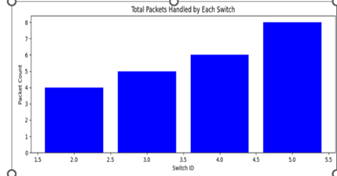

# Enhanced Traffic Optimization For Wide Area Network Management IN SDN

## Table of contents

- [Overview](#overview)
- [Screenshot](#screenshot)
- [Architecture Diagram](#my-process)
- [Built with](#built-with)
- [Installation](#installation)
- [Project structure](#structure)
- [Database storage](#database)
- [Author](#author)


## Overview 
- This SD-WAN Controller leverages OpenFlow and SDN to dynamically route traffic based on real-time metrics, reducing latency by 25% and increasing throughput by 15% in simulations. It optimizes bandwidth and enhances network performance through efficient path selection and traffic prioritization.

## Screenshot
- ### Monitering active and inactive switches
  

- ### Monitering packet counts
  

## Architecture Diagram

  

## Built with

  - FastAPI
  - Python
  - YOLOv8 for object detection
  - YOLOv11 (instant segmentation) for detecting fruit freshness
  - KMeans clustering algorithm

- ### Libraries
  - `Ultralytics`
  - `Opencv-python`
  - `numpy`, `pandas` for data handling
  - `uvicorn` for FastAPI

## Installation

### Prerequirements
  - `Ubuntu-20.04 LTS`
  - `python3.11`
  - `DB Browser` - to see the database

### Installation steps

  - Install [ubuntu 20.04](https://releases.ubuntu.com/focal/?_ga=2.264851079.966488300.1730997625-846674597.1730997624) 
  
  - Open terminal and run the following commands.
  ```
    git clone https://github.com/Sabari2005/SDWAN_Controller.git
    cd SDWAN_CONTROLLER
  ```
  ```
  pip install -r requirements.txt
  ```
  - Execute each commands in a seperate terminal
  ```
  python index.py
  python model1_fastapi.py
  python model2_fastapi.py
  ```
  - Open ` http://127.0.0.1:8000` in your browser

## Project structure

```
├──          
├── static
│   ├── css                    # Frontend styling files
│   └── images                 # Static images (if any)
├── templates
│   └── index.html             # Main HTML page
├── index.py   
├── model1_fastapi.py          
├── model2_fastapi.py                 
├── requirements.txt           # Python dependencies
└── README.md                  # This file
```

## Sample model Output
- ### Product details detection and recognition model(real time images)
   

   

## Database Storage

- you can see the product details in 
## Author

- Sabari Vadivelan S (Team Leader) - Contact Gmail [sabari132005@gmail.com]()
- Kamal M (Member 1)
- Uvarajan D (Member 2)
- Kaviarasu K (Member 3)