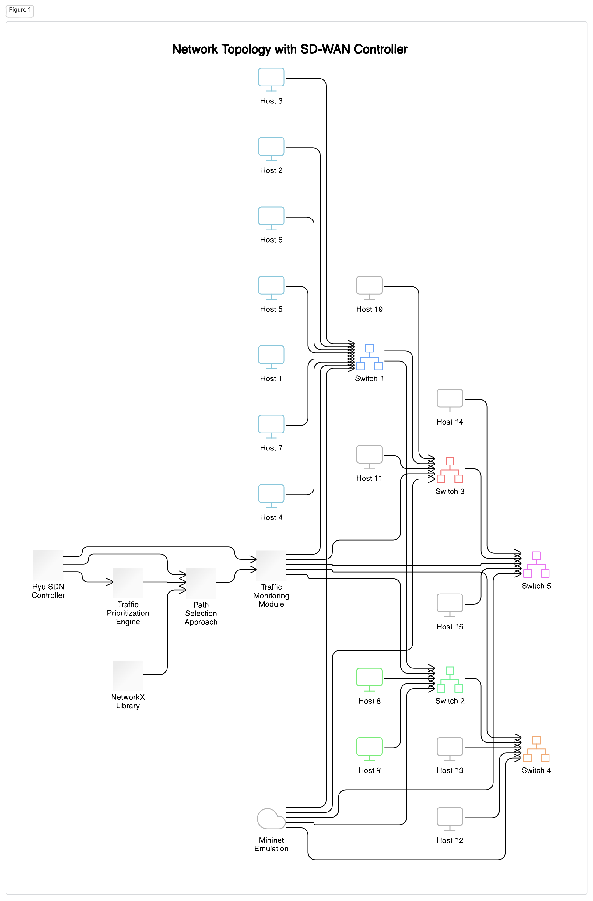

# Enhanced Traffic Optimization For Wide Area Network Management IN SDN

## Table of contents

- [Overview](#overview)
- [Technology Used]() 
- [Screenshot](#screenshot)
- [Architecture Diagram](#my-process)
- [Built with](#built-with)
- [Installation](#installation)
- [Project structure](#structure)
- [Author](#author)


## Overview 
- This SD-WAN Controller leverages OpenFlow and SDN to dynamically route traffic based on real-time metrics, reducing latency by 25% and increasing throughput by 15% in simulations. It optimizes bandwidth and enhances network performance through efficient path selection and traffic prioritization.

- ## Technologies used:
  - ### Mininet: 
      Mininet is a network emulation platform that enables the creation of virtual networks on a single machine, commonly used for software-defined networking (SDN) research, testing, and education. It allows users to emulate complete networks, including hosts, switches, links, and controllers, using lightweight virtualization techniques like network namespaces and virtual Ethernet pairs in Linux to create a realistic network topology similar to real-world networking. Mininet supports OpenFlow switches and can connect to both remote and local SDN controllers, such as the Ryu controller, to manage network behavior effectively.

  - ### Ryu Controller:
      Ryu is an open-source software-defined networking (SDN) controller framework that provides a platform for implementing SDN controllers to control network flows in OpenFlow-enabled switches, routers, and other network devices. It uses the OpenFlow protocol and other southbound protocols to communicate with network devices, enabling management of network traffic based on high-level policies defined within the controller's code. Ryu supports multiple OpenFlow versions (including OpenFlow 1.3) and offers a Python-based API for developing network control applications like traffic engineering, network monitoring, load balancing, and firewalling.

## Screenshot
- ### Initializing programs
  

  

  

- ### Monitering active and inactive switches
  

  

- ### Monitering packet counts
  

    

## Architecture Diagram

  

## Built with

  - Python3

- ### Environment

  - Ubuntu 20.04

- ### Libraries

  - `Mininet`
  - `Ryu`
  - `networkX`
  - `logging`  

## Installation

### Prerequirements
  - `Ubuntu-20.04 LTS`
  - `python3.10` or `above`

### Installation steps

  - Install [ubuntu 20.04](https://releases.ubuntu.com/focal/?_ga=2.264851079.966488300.1730997625-846674597.1730997624) 

  - Update system packages
  ```
  sudo apt update
  sudo apt upgrade
  ```

  - Install mininet
  ```
  git clone https://github.com/mininet/mininet.git
  cd mininet
  sudo ./util/install.sh -a
  ```
  - verify mininet is installed
  ```
  sudo mn --version
  ```

  - Open terminal and run the following commands.
  ```
    git clone https://github.com/Sabari2005/SDWAN_Controller.git
    cd SDWAN_CONTROLLER
  ```
  ```
  pip install -r requirements.txt
  ```
  - Execute each commands in a seperate terminal

    - run the topology.py file

      ```
      sudo python3 topology.py
      ```
    - run the app.py file
      ```
      ryu-manager app.py
      ```
  - In the topology.py terminal `mininet` is opened , Execute the following command

  ```
  mininet> h1 ping h7
  ```

  - In the ryu-manager(app.py terminal) you can able to moniter the active switches and total number of packets handled


## Project structure

```
├──          
├── assets
│   ├── active-inactive.png
│   ├── architecuture.png
│   ├── overall_output.png
│   ├── packets_handle.png
│   ├── packets_handle2.png
│   ├── sdn.mp4
│   └── active-inactive2.png                    
├── topology.py          
├── app.py                 
├── requirements.txt           
└── README.md                 
```

## Sample model Output
 - Overall-output

   
 
 - Watch the demo video - [click here](./assets/sdn.mp4)

## Author

- Sabari Vadivelan S 
- Uvarajan D
- Sarathi S